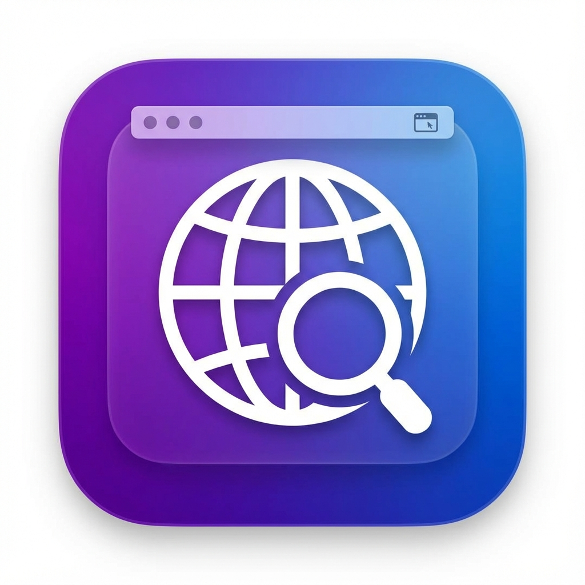

# MenuBar Web Apps 🌐

A powerful, customizable macOS menu bar utility that allows you to pin any website as a floating window. Perfect for quick access to AI assistants (ChatGPT, Gemini, Perplexity, Claude), social media, or any other web-based tool, completely independently of your main browser.

**Key Feature:** Works on macOS Monterey and later, supporting modern web apps that might otherwise break in older WebKit wrappers (like MenuBar X on Monterey). It uses **Electron (Chromium)** to ensure maximum compatibility.



## ✨ Features

-   **Any Website**: Add unlimited websites to your menu bar.
-   **Floating Windows**: Windows stay on top of fullscreen apps (useful for quick reference while working).
-   **Auto-Favicons**: Automatically fetches and uses the website's favicon for the menu bar icon.
-   **Custom Icons**: Right-click any icon to upload your own custom PNG, JPG, or ICO image.
-   **Quick Add**: One-click setup for popular AI tools: ChatGPT, Gemini, Perplexity, Claude, Grok, and Copilot.
-   **Smart Window Management**:
    -   **Hide on Blur**: Click outside the window to automatically hide it.
    -   **Single Window Mode**: Opening one app automatically closes others to keep your screen clean.
    -   **Toggle**: Click the menu bar icon to show/hide.
-   **Persistent**: Remembers window size and position for each site.

## 🚀 Installation

### Option 1: Download Pre-built App
*(If you have released a version, link it here. For now, you can build it yourself)*

### Option 2: Build from Source

1.  **Prerequisites**: You need [Node.js](https://nodejs.org/) installed.
2.  **Clone the repository**:
    ```bash
    git clone https://github.com/Omkar-glitch/menubar-web-apps.git
    cd menubar-web-apps
    ```
3.  **Install dependencies**:
    ```bash
    npm install
    ```
4.  **Run in development mode**:
    ```bash
    npm start
    ```
5.  **Build standalone macOS App (.dmg / .app)**:
    ```bash
    npm run build
    ```
    The output will be in the `dist/` folder. You can drag `MenuBar Web Apps.app` to your Applications folder.

## 🛠️ How It Works (Technical Details)

This app is built with **Electron**, which bundles a Chromium browser engine. This ensures that even if your macOS version has an old version of Safari/WebKit (common on Monterey), modern web apps will still load perfectly.

### Project Structure

-   **`main.js`**: The brains of the operation. Handles the Electron main process, tray icons, window management, and inter-process communication (IPC). It implements the logic for "always on top" floating windows and ensures they appear over fullscreen apps. It also manages the icon caching system (bundling Python-generated PNGs for reliability).
-   **`renderer.js`**: The logic for the Settings window (`index.html`). Handles adding/removing sites and communication with the main process.
-   **`preload.js`**: A security bridge that allows the renderer process to talk to the main process safely defined APIs.
-   **`site-window.html`**: The actual container for the webview. It includes a custom title bar with "Close", "Hide", and "Reload" controls.
-   **`styles.css`**: Styling for the settings UI, featuring a modern glassmorphism aesthetic.
-   **`icons/`**: Contains bundled default icons (generated via Python/Pillow) to ensure menu bar visibility even if fetching favicons fails.
-   **`package.json`**: Configures the build settings for `electron-builder` to create a proper macOS `.app` and `.dmg`.

## 🤝 Contributing

Feel free to fork this repository and submit Pull Requests!

1.  Fork the Project
2.  Create your Feature Branch (`git checkout -b feature/AmazingFeature`)
3.  Commit your Changes (`git commit -m 'Add some AmazingFeature'`)
4.  Push to the Branch (`git push origin feature/AmazingFeature`)
5.  Open a Pull Request

## 📄 License

Distributed under the MIT License. See `LICENSE` for more information.
